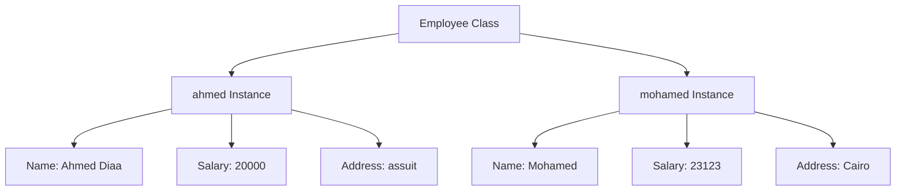

"""Modeling real Systems :
related information : 
each employee has information : name , age , address , salary ,etc
each student has name, email , gpa , courses
to solve this complex we make a class that has so many objects 

"""
#define a class 
class Employee :
    name = None
    salary = None
    address = None

ahmed = Employee() # we create instance which has multiple objects inside it 
ahmed.name = "Ahmed Diaa"
 # we define every object 
ahmed.salary  = 20000
ahmed.address = "assuit"
#_________________________________________
#we can create multiple objects for every class
mohamed = Employee()# Modeling Real Systems

## Overview
To solve complex systems, we use classes that encapsulate related information into objects.

## Example: Employee Class

### Class Definition
```python
class Employee:
    name = None
    salary = None
    address = None
```

### Creating Instances
```python
ahmed = Employee()  # Creating an instance
ahmed.name = "Ahmed Diaa"
ahmed.salary = 20000
ahmed.address = "assuit"
```

### Creating Multiple Objects
```python
mohamed = Employee()
mohamed.name = "Mohamed"
mohamed.salary = 23123
mohamed.address = "Cairo"
```

## Diagram


## Key Points
- **Related Information:** Classes encapsulate related information.
- **Multiple Objects:** We can create multiple instances for each class.
- **Object Data:** Each object has its own data.

### Additional Notes
- Everything in Python is an object.
mohamed.name =""
mohamed.salary = 23123
mohamed.address = ""
#every object has its data 
#every thing in python is object
 