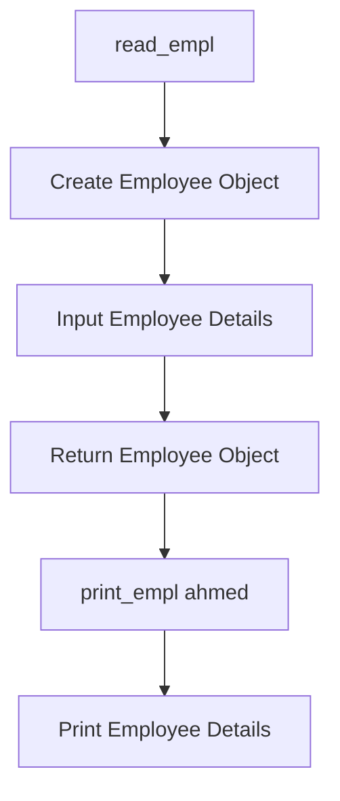
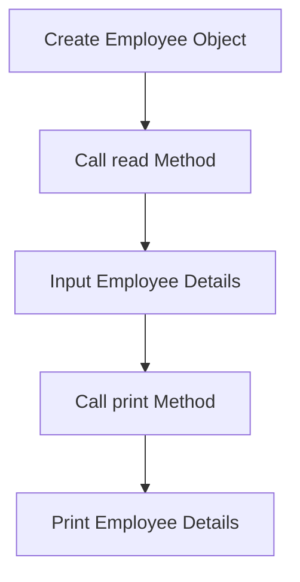
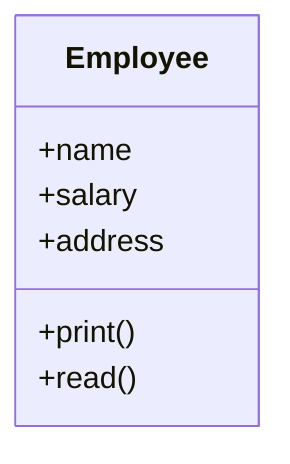
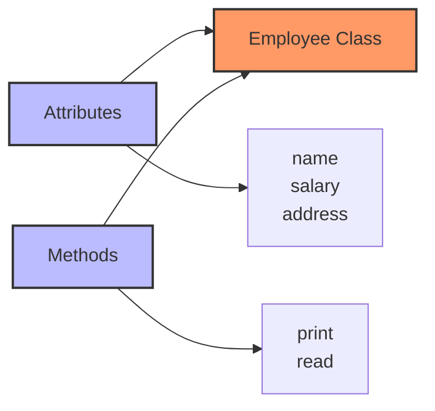

# Read and Write

## Initial Version

### Class Definition and Functions

```python
class Employee:
    name = None
    salary = None
    address = None

def print_empl(object):
    print("Employee name is: ", object.name)
    print("Employee salary is: ", object.salary)
    print("Employee address is: ", object.address)
    # here it prints the employee details using the object we pass

def read_empl():
    obj = Employee()  # create an object of the class
    # read the employee details from the user
    obj.name = input("Enter Employee name: ")
    obj.salary = float(input("Enter Employee salary: "))
    obj.address = input("Enter Employee address: ")
    # return the object which contains the employee details
    return obj

ahmed = read_empl()  # read the employee details with object ahmed
print_empl(ahmed)  # print the employee details using the object ahmed
```

### Flowchart



## Improved Version

### Class Definition with Methods

```python
class Employee:
    name = None
    salary = None
    address = None
    
    def print(self):  # self is a reference to the object 
        print("Employee name is: ", self.name) 
        print("Employee salary is: ", self.salary)
        print("Employee address is: ", self.address)
        
    def read(self):
        self.name = input("Enter Employee name: ")
        self.salary = float(input("Enter Employee salary: "))
        self.address = input("Enter Employee address: ")

ahmed = Employee()  # create an object of the class
ahmed.read()  # read the employee details using the object ahmed
ahmed.print()  # print the employee details using the object ahmed
```

### Flowchart



### Notes

- When we define functions inside a class, they are called **methods**.
- When we define a method inside a class, we should use `self` as a parameter to refer to the object to access class variables.

## Encapsulation

### Explanation

- **Encapsulation** is the process of grouping the data (attributes) and the methods (functions) that operate on the data into a single unit called a class.
- One place contains all relevant variables (attributes) and functions (methods).

### Class Diagram



### Concept Visualization


