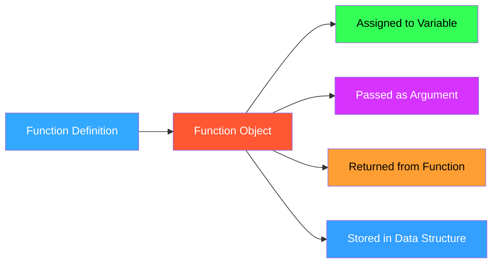

I'll customize these notes with Obsidian styling and colors:

# Python Functions as First-Class Objects

## <span style="color: #33a8ff;">Variable == Function</span>

> [!info]+ 🔄 Functions as Variables
> 
> - In Python, functions are first-class objects
> - Everything in Python is treated as an object
> - Functions can be assigned to variables and called through those variables

```python
def f():
    return "Variable works as function"

x = f()  # Call function and assign result to x
print(x)  # => will print: Variable works as function

# Assigning function object (not result) to variable
y = f  # Notice: no parentheses
print(y())  # => will print: Variable works as function
```

## <span style="color: #33ff57;">Passing Functions as Arguments</span>

> [!note]+ 🧩 Higher-Order Functions Functions that take other functions as parameters are called "higher-order functions"

```python
def process(iterable_object, func):
    sum = 0
    for value in iterable_object:
        sum += func(value)
    return sum
    
# Example usage
lst = [1, -2, 3, -4, 5, -6]
print(process(lst, abs))  # abs is a built-in function passed as an argument
```

> [!tip]+ 📋 Function Collections We can make a list of functions and iterate over them:
> 
> ```python
> def add1(x): return x + 1
> def square(x): return x * x
> def double(x): return x * 2
> 
> funcs = [add1, square, double]
> value = 5
> 
> for func in funcs:
>    print(func(value))
> ```

## <span style="color: #ff5733;">Key Argument in Sorting</span>

> [!example]+ 🔑 Using the key Parameter The `key` parameter takes a function that transforms each element before comparison

```python
lst = ['i', 'am', 'Ahmed', 'Diaa']

# Default sort (based on ASCII values - capitals come first)
print(sorted(lst))  # ['Ahmed', 'Diaa', 'am', 'i']

# Sort ignoring case
print(sorted(lst, key=str.lower))  # ['am', 'Ahmed', 'Diaa', 'i']

# Sort by length
print(sorted(lst, key=len))  # ['i', 'am', 'Diaa', 'Ahmed']

# Custom sorting: sort by last character (lowercase)
def sort_by_last_char(string):
    if not string:
        return ""
    return string[-1].lower()
    
print(sorted(lst, key=sort_by_last_char))
```

## <span style="color: #d633ff;">Function Replacement</span>

> [!warning]+ 🔄 Dynamic Method Replacement In Python, methods can be replaced at runtime - powerful but use with caution!

```python
class Employee:
    def __init__(self, name):
        self.name = name
        
    def print(self):
        print(self.name)
        
def hack():
    print("hey")
    
if __name__ == '__main__':
    emp = Employee('ahmed')
    emp.print()  # Prints: ahmed
    
    # Replace the print method with hack function
    emp.print = hack
    emp.print()  # Prints: hey
```

## Scope Visualization


