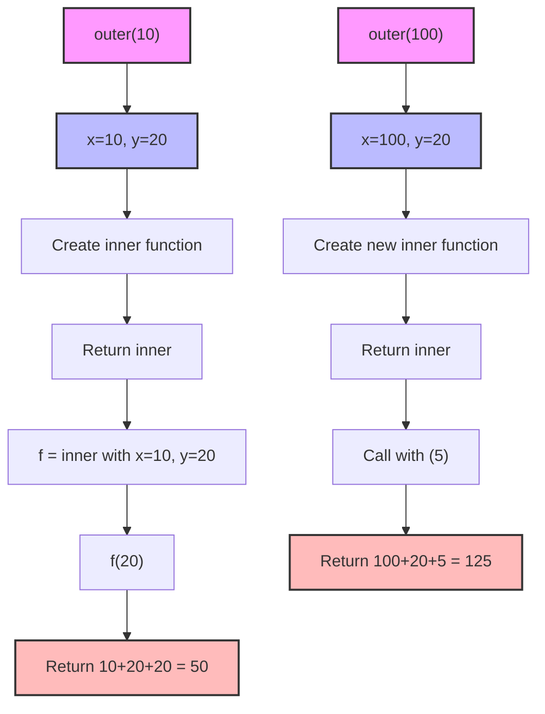
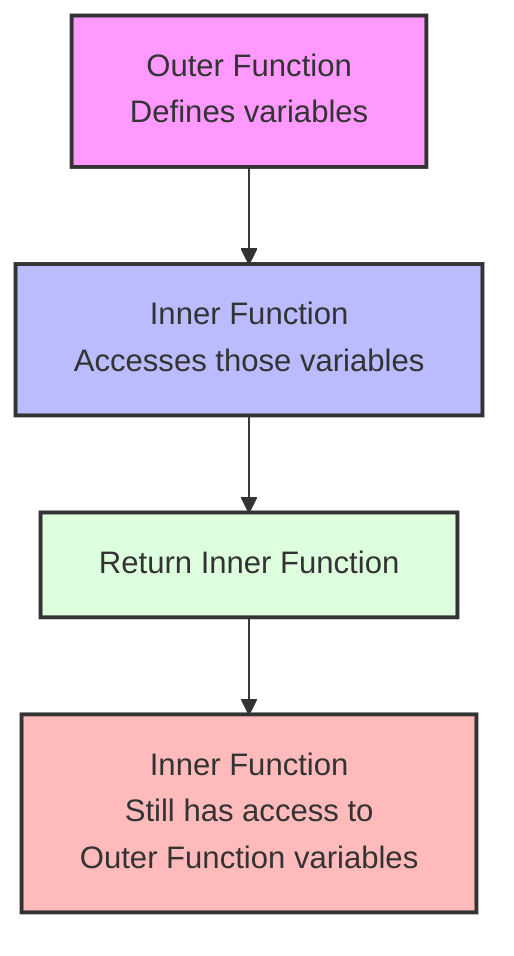
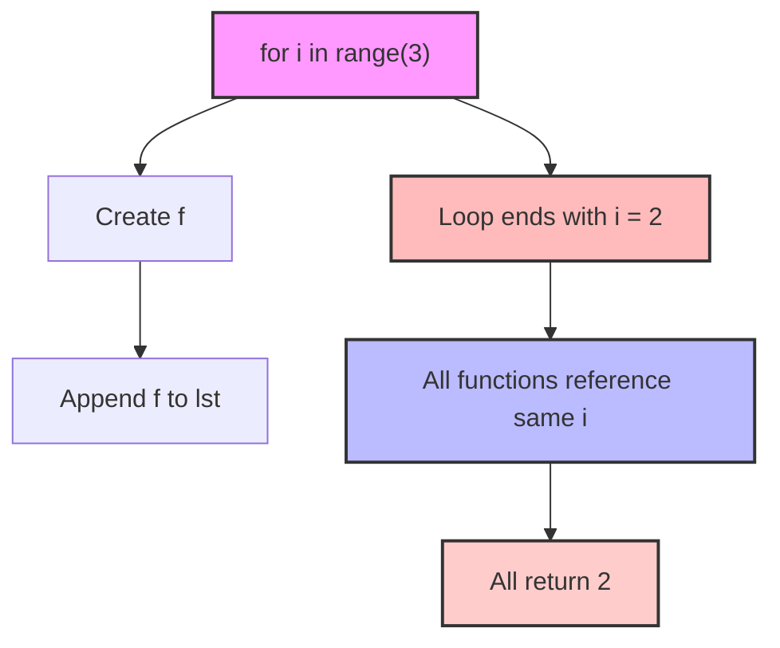
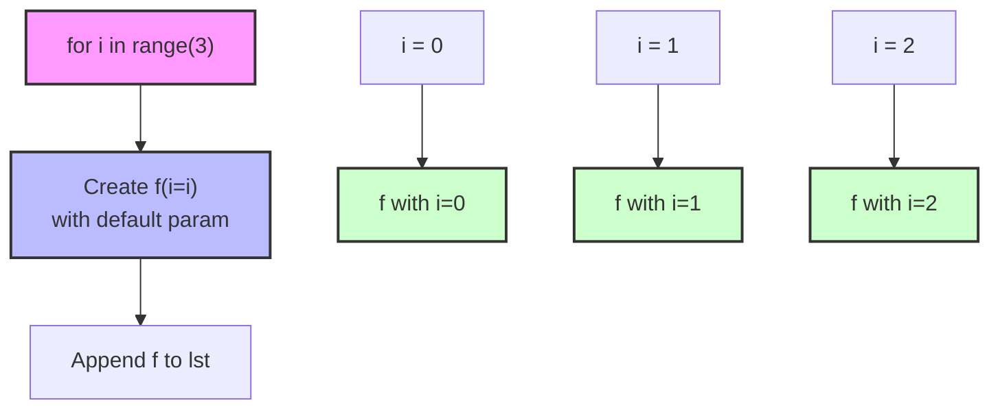
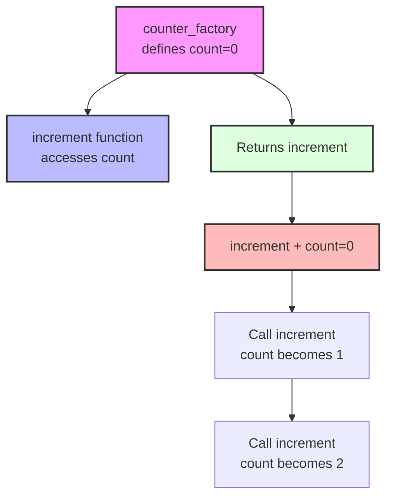
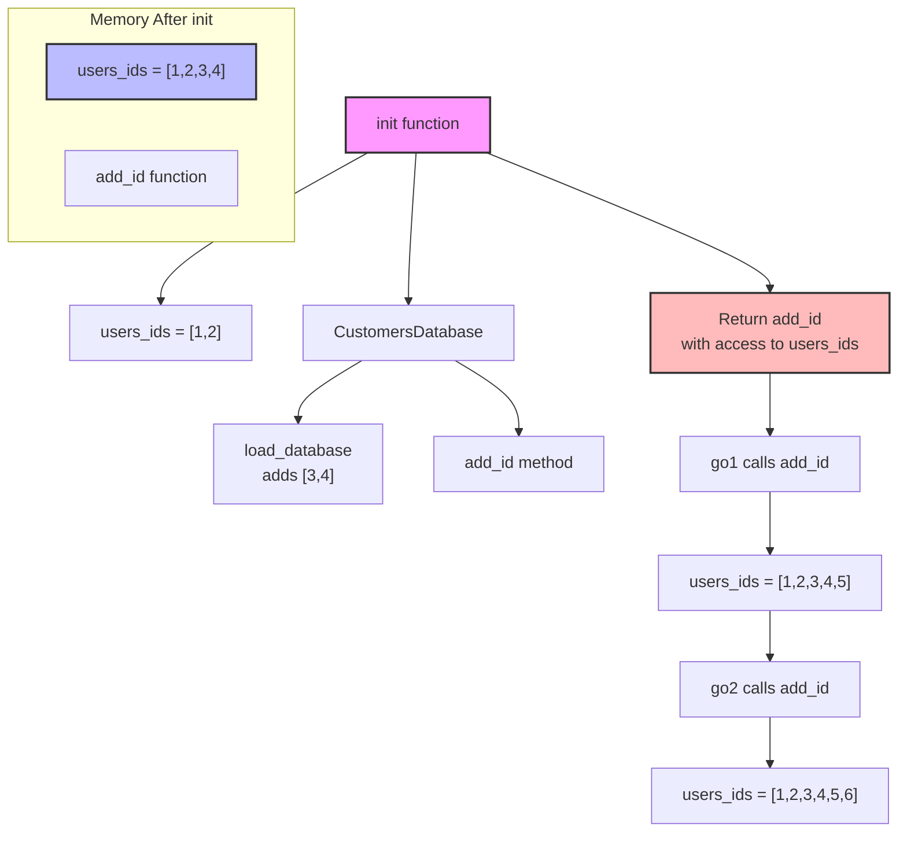
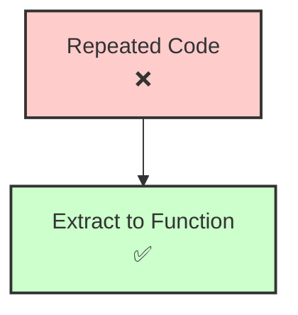
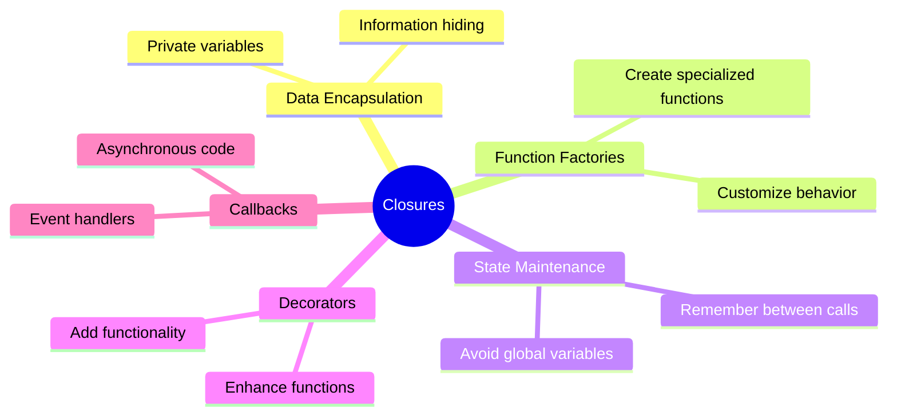
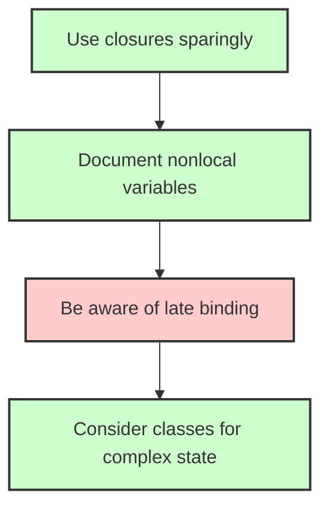

# Python Closures and Scope

## Variable Identity in Closures

```python

def outer(x):

    y = 20

    print(id(y))  # Memory address of y in outer scope

    def inner(f):

        print(id(y))  # Same memory address as in outer scope

        return x + y + f

    return inner

  

if __name__ == '__main__':

    f = outer(10)  # x=10 is captured in the closure

    print(f(20))   # 10 + 20 + 20 = 50

    print(outer(100)(5))  # 100 + 20 + 5 = 125

```




> **Key Point**: The `id(y)` prints show that the inner function references the exact same `y` variable from the outer scope, not a copy. This demonstrates true closure behavior.

## Basic Closure Diagram



## Basic Closure Example

```python

def outer_function(x):

    y = 10

    def inner_function():

        return x + y

    return inner_function

  

closure1 = outer_function(5)

closure2 = outer_function(10)

  

print(closure1())  # 15 (5 + 10)

print(closure2())  # 20 (10 + 10)

```
## Late Binding Problem

```python

def fun():

    lst = []

    for i in range(3):  # i: 0, 1, 2

        def f():

            return i  # All functions reference the same i

        lst.append(f)

    # At this point, i = 2

    return lst

  

lst = fun()

for f in lst:

    print(f())  # Prints: 2, 2, 2

```



  

## Solution to Late Binding: Default Parameters

```python

def fun():

    lst = []

    for i in range(3):

        def f(i=i):  # Each function gets its own copy of i

            return i  # Values: 0, 1, 2

        lst.append(f)

    return lst

  

lst = fun()

for f in lst:

    print(f())  # Prints: 0, 1, 2

```



## Using `nonlocal` Keyword
```python

def counter_factory():

    count = 0  # ← Enclosed variable

    def increment():

        nonlocal count  # ← Access to enclosed variable

        count += 1

        return count

    return increment  # ← Return inner function

```



  

## Database Example with Closures

```python

def init():

    class CustomersDatabase:

        def load_database(self):

            nonlocal users_ids  # Access users_ids from outer scope

            users_ids += [3, 4]  # Modify the outer variable

        def add_id(self, id):

            if id not in users_ids:

                print(f"Adding {id}")

                users_ids.append(id)

                print(users_ids)

            else:

                print(f"{id} is already there")

    users_ids = [1, 2]  # Create the enclosed variable

    db = CustomersDatabase()

    db.load_database()  # Modify users_ids → [1,2,3,4]

    return db.add_id  # Return method with access to users_ids

```



## DRY Principle (Don't Repeat Yourself)

  



## Practical Example: Configurable Logger

```python

def create_logger(level):

    def logger(message):

        if level == "DEBUG":

            print(f"[DEBUG] {message}")

        elif level == "INFO":

            print(f"[INFO] {message}")

        elif level == "WARNING":

            print(f"[WARNING] {message}")

        elif level == "ERROR":

            print(f"[ERROR] {message}")

    return logger

  

debug_log = create_logger("DEBUG")

error_log = create_logger("ERROR")

  

debug_log("This is a debug message")  # [DEBUG] This is a debug message

error_log("System failure")           # [ERROR] System failure

```

  

## Closure Applications

  



## Best Practices



## Key Takeaways

  

1. **Closures** capture and preserve the enclosing function's scope

2. **nonlocal** allows modifying variables from outer scopes

3. **Default parameters** solve the late binding problem

4. **DRY** principle encourages reusable inner functions

5. **Encapsulation** keeps implementation details private