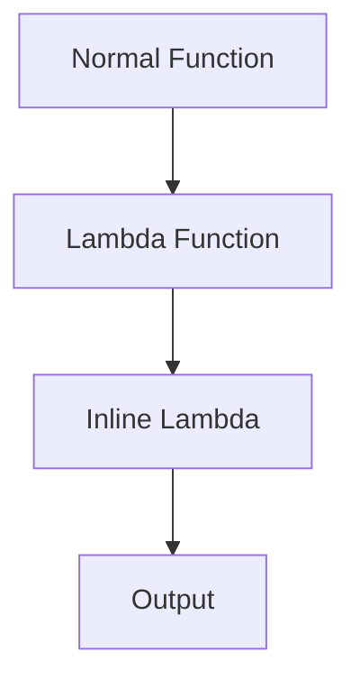
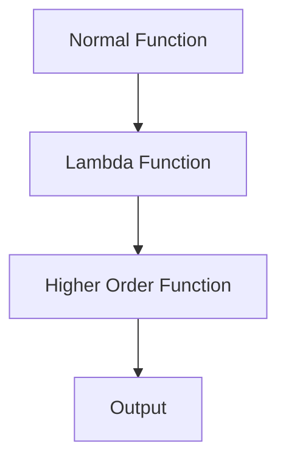
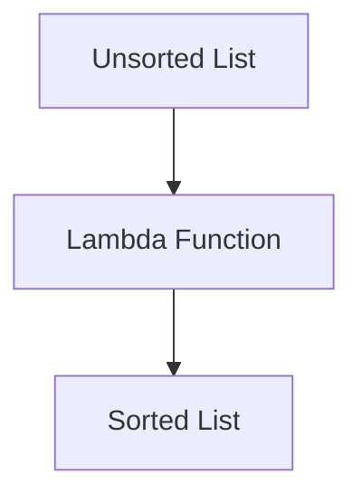
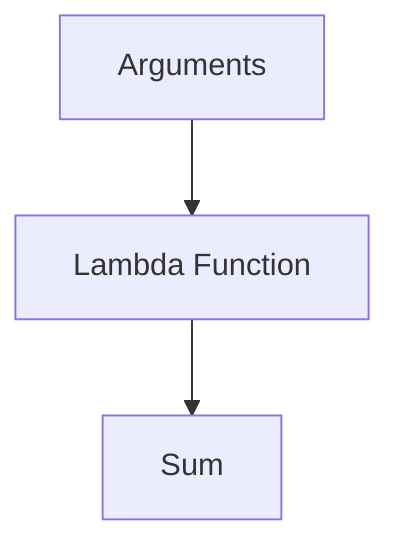
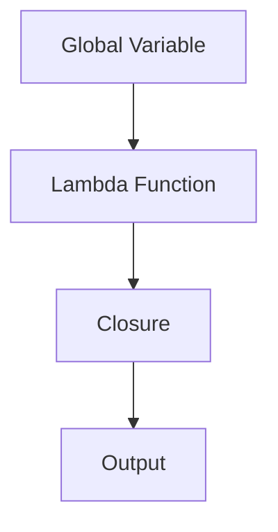
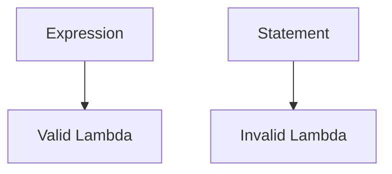
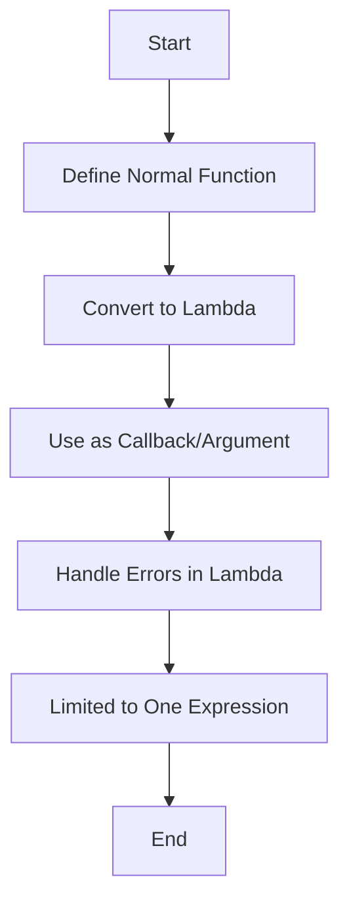
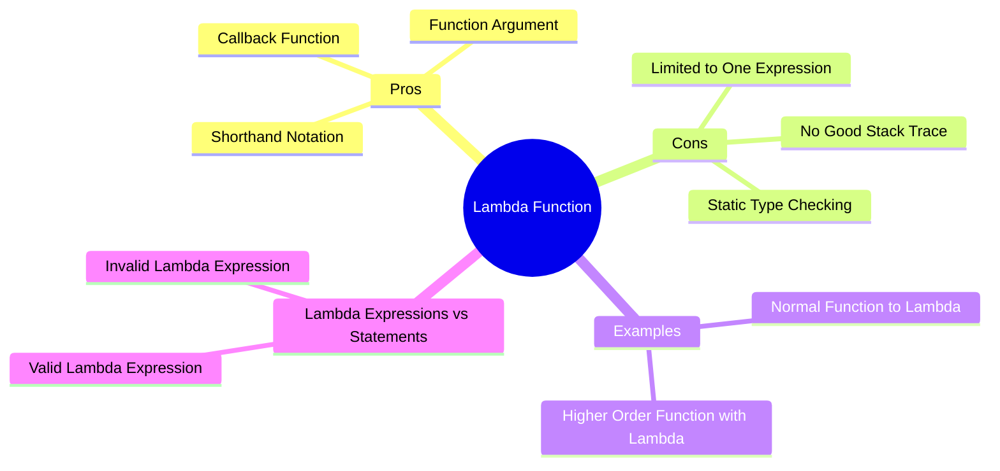

# Lambda Function

## Overview
A lambda function is an anonymous function that does not have a name.

### Pros:
- **Shorthand Notation:** Makes some code use cases simpler and more concise.
- **Callback Function:** Can be used as a callback function.
- **Function Argument:** Can be used as an argument to other functions.

### Cons:
- **No Good Stack Trace:** Errors in lambda functions do not show the specific error location.
- **Static Type Checking:** Does not work well with static type checkers like mypy and pyre.
- **Limited to One Expression:** Can only contain one expression.

## Examples

### Normal Function to Lambda

#### Normal Function
```python
def sql(x):
    return x * x

print(sql(3))
```

#### Lambda Function
```python
sq2 = lambda x: x * x
print(sq2(3))
```

#### Normal Function
```python
def name1(first, second):
    return f'{first}-{second}'

print(name1("Ahmed", "Diaa"))
```

#### Lambda Function
```python
name2 = lambda first, second: f'{first}-{second}'
print(name2("Ahmed", "Diaa"))
```

#### Inline Lambda
```python
print((lambda x, y: x * y)(2, 4))
```

### Diagram


## Normal Function to Lambda with Higher Order Functions

### Normal Function
```python
def process1(iterable, fun):
    total = 0
    for value in iterable:
        total += fun(value)
    return total

lst = [2, -4, 6]
print(process1(lst, abs))  # 12
```

### Lambda Function
```python
process2 = lambda iterable, fun: sum([fun(value) for value in iterable])
print(process2(lst, abs))  # 12
```

### Diagram


## Higher Order Function with Lambda

### Example
```python
lst = ['i', 'am', 'ahmed', 'and', 'you']
print(sorted(lst, key=lambda string: "" if not string else string[-1].lower()))
print(sorted(lst, key=lambda string: string[-1].lower() if string else ""))
```

### Diagram


## Lambda as a Normal Function

### Example
```python
s = lambda *args: sum(args)
print(s(1, 2, 3, 4, 5, 6))  # 21

res = (lambda **kwargs: sum(kwargs.values()))(a=1, b=2, c=3, d=4)
print(res)  # 10
```

### Diagram


## Lambda Closure

### Example
```python
glob = 5

def f():
    x = 10
    fun = lambda y: y + x + glob
    return fun

fun = f()
print(fun(3))  # 18
```

### Diagram


## Lambda Expressions vs Statements

### Valid Lambda Expression
```python
f = lambda x: print(x, x * x, 2 * x)
print(f(5))  # Output: 5 25 10
# None
```

### Invalid Lambda Expression
```python
# f = lambda x: assert x == 2  # Invalid syntax
```

### Diagram


## Flowchart



## Map

