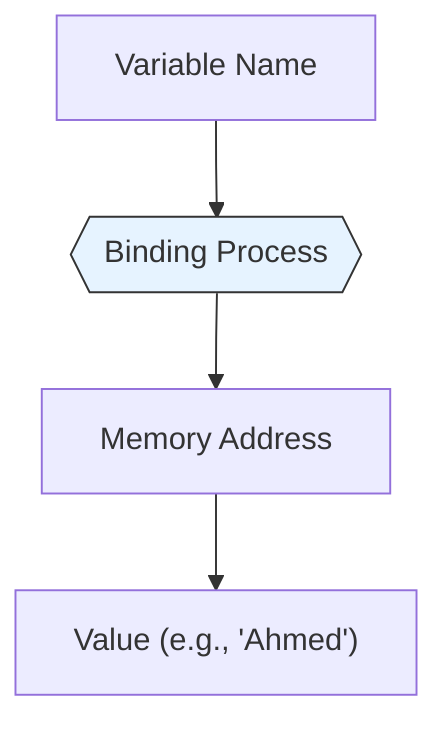
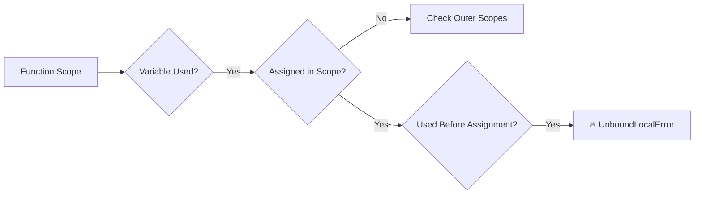

```python
# 🎯 Python Variable Binding & Scope Errors

##  Variable Binding Explained


### 🔵 **Binding Fundamentals**
```python
# Initial binding
my_name = "Ahmed"  # 🟢 Name 'my_name' → 0x111 (memory address)

# Rebinding
my_name = "diaa"   # 🔄 New value at 0x222, name updated

# Shared binding
name = my_name     # 👥 Both names point to 0x222
x = "Ahmed"        # ♻️ New binding to original value (0x111)
```

---

## 💥 UnboundLocalError Deep Dive


### 🔴 Common Error Patterns
**1. Classic Reference Before Assignment**
```python
def broken_func():
    print(y)  # ❌ Used before assignment
    y = 4     # Too late!

broken_func()  # 💥 UnboundLocalError
```

**2. Accidental Local Shadowing**
```python
x = 10  # Global

def shadow_func():
    print(x)  # ❌ Thinks x is local (due to next line)
    x = 2     # Creates local variable

shadow_func()  # 💥 UnboundLocalError
```

**3. Self-Referential Assignment**
```python
def math_func():
    x = x + 1  # ❌ Right-side x used before left-side assignment

math_func()  # 💥 UnboundLocalError
```

---

## 🛠️ Fixing Strategies

### ✅ Proper Global Usage
```python
global_counter = 0

def safe_increment():
    global global_counter  # 🟢 Explicit declaration
    global_counter += 1    # 🎯 Modifies global variable

safe_increment()  # No errors, counter → 1
```

### ✅ Local First Assignment
```python
def valid_function():
    result = 0  # 🟢 Assign before use
    result += calculate_value()
    return result
```

---

## 🔑 Key Concepts Table

| Concept | Description | Visual Cue |
|---------|-------------|------------|
| **Binding** | Name → Memory mapping | 🔗→💾 |
| **Rebinding** | Changing name's target | 🔄 |
| **Scope** | Variable visibility area | 🕵️♂️→🌍 |
| **UnboundLocalError** | Local reference before assignment | 💥📛 |

---

## 🚀 Pro Tips
1. **Use `nonlocal`** for nested functions:
   ```python
   def outer():
       count = 0
       def inner():
           nonlocal count  # 🟢 Modifies outer's count
           count += 1
   ```
   
2. **Avoid globals** where possible - use parameters/returns instead

3. **Linter Warning** - Modern IDEs will flag potential unbound errors!

---

## 🆚 Error Comparison
| Error Type | Cause | Scope | Fix |
|------------|-------|-------|-----|
| `NameError` | Name not found in any scope | Global | Define variable |
| `UnboundLocalError` | Local variable referenced before assignment | Local | Assign first/use `global` |

---

## 💡 FAQ
**Q: Why doesn't Python use outer scope variables automatically?**  
A: Prevents accidental shadowing - forces explicit declaration (`global`/`nonlocal`)

**Q: How to inspect variable bindings?**  
A: Use `id()` for memory address checks:
```python
x = 10
print(f"Memory address: {id(x)}")  # 👀 0x7f945420d310
```

