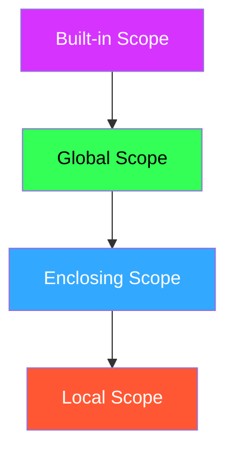

I'll enhance the notes with color styling using Obsidian's supported color syntax:

# Python Functions and Scope

## Nested Functions

```python
def abs_sum(a, b, c):
    # Hidden from global scope
    def _my_abs(x):  # Prefixed with _ to indicate "private" function
        if x < 0:
            return -x
        return x
    return _my_abs(a) + _my_abs(b) + _my_abs(c)  # Only accessible within abs_sum
```

> [!note]+ 🔵 Naming Convention In Python, we use underscore prefix (`_function_name`) to indicate that a function is meant for internal use and shouldn't be called directly from outside.

## Understanding Scope

Scope defines what variables a function can access:

- <span style="color: #ff5733;">**Local**</span>: Variables defined within the function
- <span style="color: #33a8ff;">**Enclosing**</span>: Variables from the outer function (when nested)
- <span style="color: #33ff57;">**Global**</span>: Variables defined at the module level
- <span style="color: #d633ff;">**Built-in**</span>: Python's built-in functions and objects

### Example of Enclosing Scope:

```python
def outer():
    outer_local = 30  # Enclosing variable
    def inner():
        print(outer_local)  # Accessing enclosing variable
    inner()
outer()  # => prints 30
```

## LEGB Rule

> [!important]+  Variable Lookup Order Python searches for variables in this order:
> 
> 1. <span style="color: #ff5733;">**L**ocal</span>
> 2. <span style="color: #33a8ff;">**E**nclosing</span>
> 3. <span style="color: #33ff57;">**G**lobal</span>
> 4. <span style="color: #d633ff;">**B**uilt-in</span>
> 5. If not found: `NameError` ⚠️

### Comprehensive Example:

```python
global_var = 20  # Global variable

def outer():
    outer_local = 30  # Enclosing for inner()
    x = 15  # Enclosing for inner()
    
    def inner():
        inner_loc = -5  # Local to inner()
        x = 7  # Local variable shadows the enclosing one
        
        print(inner_loc)    # Local scope
        print(x)            # Local scope (7)
        print(outer_local)  # Enclosing scope
        # print(outer_local2)  # Would cause error
        print(global_var)   # Global scope
        
    inner()
    print(x)  # Prints 15 (enclosing scope's x wasn't modified)
    
    outer_local2 = 40  # Defined after inner() call
    
outer()
```

## Modifying Variables in Outer Scopes

> [!tip]+ 🔧 Modifying Outer Variables
> 
> - Use <span style="color: #33ff57;">`global`</span> keyword to modify global variables
> - Use <span style="color: #33a8ff;">`nonlocal`</span> keyword to modify enclosing variables

### Example with nonlocal:

```python
def outer():
    count = 0  # Enclosing variable
    
    def inner():
        nonlocal count  # Allows modification of enclosing variable
        count += 1
        return count
        
    return inner  # Returns the inner function

counter = outer()
print(counter())  # 1
print(counter())  # 2
```

> [!warning]+ ⚠️ Reserved Keywords If you try to use `global` and `nonlocal` as variable names, Python will raise an `UnboundLocalError`

## Scope Visualization


