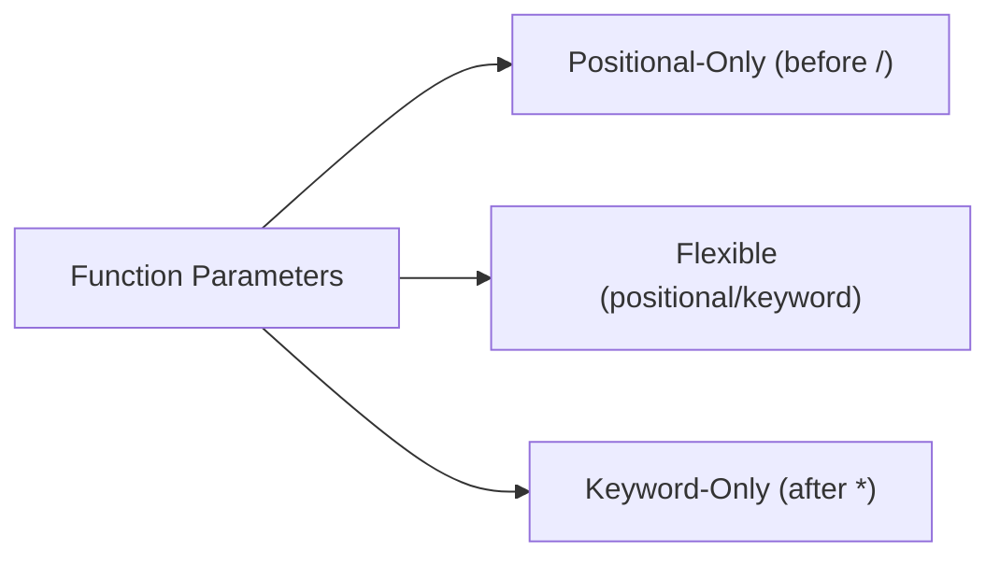

```python
#  Core Concept: Python Parameter Types
def demo(a, /, b, *, c):
    """ 
    a: Positional-only (before /)
    b: Flexible (positional or keyword)
    c: Keyword-only (after *)
    """
    return a + b + c
```

---

##  **Parameter Type Breakdown** (Visual Guide)



---

##  **Parameter Types Explained**

### 1. 🔵 **Positional-Only Parameters** (`/` separator)
```python
def func(x, /, y):  # Everything before / is positional-only
    return x ** y
```

#### ✅ Valid Usage:
```python
func(3, 2)    # 🟢 Both positional
func(3, y=2)  # 🟢 x positional, y keyword
```

#### ❌ Invalid Usage:
```python
# func(x=3, y=2)  # 🔴 TypeError: x cannot be keyword argument
```

---

### 2. 🟢 **Flexible Parameters** (Default behavior)
```python
def func(a, b, c=10):  # Can be passed positionally or by keyword
    return a + b + c
```

#### ✅ Valid Usage:
```python
func(1, 2)          # 🟢 Positional with default
func(a=1, b=2)      # 🟢 Keyword arguments
func(1, b=2, c=20)  # 🟢 Mixed style
```

---

### 3. 🟠 **Keyword-Only Parameters** (`*` separator)
```python
def func(*, api_key, timeout):  # Everything after * must be keyword
    return f"{api_key}:{timeout}"
```

#### ✅ Valid Usage:
```python
func(api_key="abc123", timeout=30)  # 🟢 Proper keyword usage
```

#### ❌ Invalid Usage:
```python
# func("abc123", 30)  # 🔴 TypeError: positional args not allowed
```

---

## 🧩 **Parameter Comparison Table**

| Feature               | `/` (Positional-Only) | Default Parameters | `*` (Keyword-Only) |
|-----------------------|-----------------------|--------------------|--------------------|
| **Enforcement**       | No keywords allowed   | Flexible           | Keywords required  |
| **Position in Def**   | Beginning             | Middle             | End                |
| **Use Case**          | Internal API safety   | General purpose    | Explicit arguments |
| **Example**           | `def f(x, /)`         | `def f(a, b=5)`    | `def f(*, key)`    |

---

## 💥 **Common Errors & Solutions**

### 1. 🔴 **Positional After Keyword**
```python
# ❌ Broken
calculate(a=1, 20, c=3)  # SyntaxError: positional follows keyword

# ✅ Fixed
calculate(1, 20, c=3)    # 🟢 All positional first
calculate(a=1, b=20, c=3) # 🟢 All keywords
```

### 2. 🔴 **Missing Required Arguments**
```python
def connect(host, /, port, *, timeout):
    ...

# ❌ Broken
connect('localhost', timeout=5)  # TypeError: missing 'port'

# ✅ Fixed
connect('localhost', 8080, timeout=5)  # 🟢 All required args provided
```

---

## 🚀 **Pro Tips**
1. **API Design**: Use `/` and `*` to create clear boundaries between parameter types
2. **Documentation**: Always specify parameter types in docstrings:
   ```python
   def process(data, /, chunk_size, *, validate=True):
       """
       data: Positional-only input
       chunk_size: Flexible parameter
       validate: Keyword-only flag
       """
   ```
3. **Debugging**: Use `inspect.signature()` to view parameter requirements:
   ```python
   import inspect
   print(inspect.signature(process))  # (data, /, chunk_size, *, validate=True)
   ```

---

## � **Parameter Enforcement Map**
```python
def full_example(pos1, pos2, /, flex1, flex2=10, *, kw1, kw2=20):
    ...
```

| Parameter | Type          | Passing Style          | Required | Default |
|-----------|---------------|------------------------|----------|---------|
| `pos1`    | Positional-Only | Position only          | Yes      | -       |
| `pos2`    | Positional-Only | Position only          | Yes      | -       |
| `flex1`   | Flexible       | Position or Keyword    | Yes      | -       |
| `flex2`   | Flexible       | Position or Keyword    | No       | 10      |
| `kw1`     | Keyword-Only   | Keyword only           | Yes      | -       |
| `kw2`     | Keyword-Only   | Keyword only           | No       | 20      |
```
