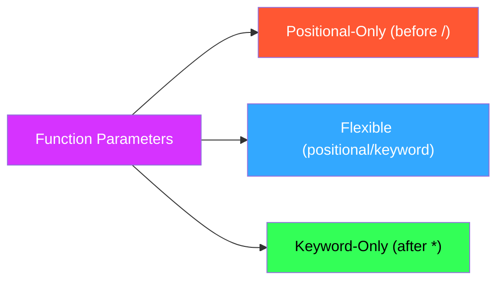

I'll customize these notes on Python parameter types with Obsidian styling and colors:

# 🎯 Python Parameter Types

## <span style="color: #33a8ff;">Core Concept</span>

```python
def demo(a, /, b, *, c):
    """ 
    a: Positional-only (before /)
    b: Flexible (positional or keyword)
    c: Keyword-only (after *)
    """
    return a + b + c
```

## <span style="color: #33ff57;">Parameter Type Breakdown</span>



## 📚 <span style="color: #ff5733;">Parameter Types Explained</span>

### 1. 🔵 **Positional-Only Parameters** (`/` separator)

> [!info]+ Parameters before the `/` must be passed positionally
> 
> ```python
> def func(x, /, y):  # Everything before / is positional-only
>    return x ** y
> ```

#### ✅ Valid Usage:

```python
func(3, 2)    # 🟢 Both positional
func(3, y=2)  # 🟢 x positional, y keyword
```

#### ❌ Invalid Usage:

```python
# func(x=3, y=2)  # 🔴 TypeError: x cannot be keyword argument
```

### 2. 🟢 **Flexible Parameters** (Default behavior)

> [!info]+ Parameters without special markers can be passed either way
> 
> ```python
> def func(a, b, c=10):  # Can be passed positionally or by keyword
>    return a + b + c
> ```

#### ✅ Valid Usage:

```python
func(1, 2)          # 🟢 Positional with default
func(a=1, b=2)      # 🟢 Keyword arguments
func(1, b=2, c=20)  # 🟢 Mixed style
```

### 3. 🟠 **Keyword-Only Parameters** (`*` separator)

> [!info]+ Parameters after the `*` must be passed by keyword
> 
> ```python
> def func(*, api_key, timeout):  # Everything after * must be keyword
>    return f"{api_key}:{timeout}"
> ```

#### ✅ Valid Usage:

```python
func(api_key="abc123", timeout=30)  # 🟢 Proper keyword usage
```

#### ❌ Invalid Usage:

```python
# func("abc123", 30)  # 🔴 TypeError: positional args not allowed
```

## 🧩 <span style="color: #d633ff;">Parameter Comparison Table</span>

|Feature|<span style="color: #ff5733;">`/` (Positional-Only)</span>|<span style="color: #33a8ff;">Default Parameters</span>|<span style="color: #33ff57;">`*` (Keyword-Only)</span>|
|---|---|---|---|
|**Enforcement**|No keywords allowed|Flexible|Keywords required|
|**Position in Def**|Beginning|Middle|End|
|**Use Case**|Internal API safety|General purpose|Explicit arguments|
|**Example**|`def f(x, /)`|`def f(a, b=5)`|`def f(*, key)`|

## 💥 <span style="color: #ff9f33;">Common Errors & Solutions</span>

### 1. 🔴 **Positional After Keyword**

> [!warning]+ Positional arguments must come before keyword arguments
> 
> ```python
> # ❌ Broken
> calculate(a=1, 20, c=3)  # SyntaxError: positional follows keyword
> 
> # ✅ Fixed
> calculate(1, 20, c=3)    # 🟢 All positional first
> calculate(a=1, b=20, c=3) # 🟢 All keywords
> ```

### 2. 🔴 **Missing Required Arguments**

> [!warning]+ All required parameters must be provided
> 
> ```python
> def connect(host, /, port, *, timeout):
>    ...
> 
> # ❌ Broken
> connect('localhost', timeout=5)  # TypeError: missing 'port'
> 
> # ✅ Fixed
> connect('localhost', 8080, timeout=5)  # 🟢 All required args provided
> ```

## 🚀 <span style="color: #33a8ff;">Pro Tips</span>

> [!tip]+ API Design Use `/` and `*` to create clear boundaries between parameter types

> [!tip]+ Documentation Always specify parameter types in docstrings:
> 
> ```python
> def process(data, /, chunk_size, *, validate=True):
>    """
>    data: Positional-only input
>    chunk_size: Flexible parameter
>    validate: Keyword-only flag
>    """
> ```

> [!tip]+ Debugging Use `inspect.signature()` to view parameter requirements:
> 
> ```python
> import inspect
> print(inspect.signature(process))  # (data, /, chunk_size, *, validate=True)
> ```

## 📊 <span style="color: #33ff57;">Parameter Enforcement Map</span>

```python
def full_example(pos1, pos2, /, flex1, flex2=10, *, kw1, kw2=20):
    ...
```

|Parameter|Type|Passing Style|Required|Default|
|---|---|---|---|---|
|<span style="color: #ff5733;">`pos1`</span>|Positional-Only|Position only|Yes|-|
|<span style="color: #ff5733;">`pos2`</span>|Positional-Only|Position only|Yes|-|
|<span style="color: #33a8ff;">`flex1`</span>|Flexible|Position or Keyword|Yes|-|
|<span style="color: #33a8ff;">`flex2`</span>|Flexible|Position or Keyword|No|10|
|<span style="color: #33ff57;">`kw1`</span>|Keyword-Only|Keyword only|Yes|-|
|<span style="color: #33ff57;">`kw2`</span>|Keyword-Only|Keyword only|No|20|
