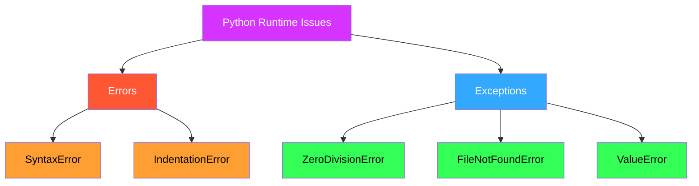
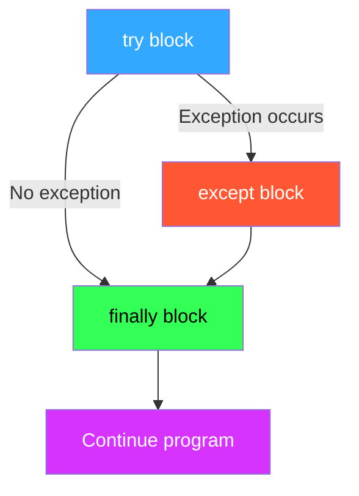

I'll customize these notes on Python exceptions with Obsidian styling and colors:

# Python Exceptions and Error Handling

## <span style="color: #ff5733;">What is an Exception?</span>

> [!info]+ Definition An **exception** is an unexpected event that occurs during program execution. For example:
> 
> ```python
> divide_by_zero = 7 / 0  # Raises ZeroDivisionError
> ```
> 
> This code causes an exception because dividing by zero is not allowed.

## <span style="color: #33a8ff;">Python Logical Errors (Exceptions)</span>

> [!note]+ Runtime Errors Errors that occur at runtime (after passing the syntax test) are called **exceptions** or **logical errors**.

They occur in situations like:

- Trying to open a file that doesn't exist (<span style="color: #ff9f33;">`FileNotFoundError`</span>)
- Dividing a number by zero (<span style="color: #ff9f33;">`ZeroDivisionError`</span>)
- Importing a module that doesn't exist (<span style="color: #ff9f33;">`ImportError`</span>)

When these errors occur, Python creates an **exception object**. If not handled, it prints a **traceback** with details about the error.

### Example:

```python
divide_numbers = 7 / 0
print(divide_numbers)
```

**Output:**

```
Traceback (most recent call last):
  File "<string>", line 1, in <module>
ZeroDivisionError: division by zero
```

## <span style="color: #33ff57;">Python Built-in Exceptions</span>

> [!tip]+ View All Exceptions Python has many built-in exceptions that are raised when specific errors occur. You can view all built-in exceptions using:
> 
> ```python
> print(dir(locals()['__builtins__']))
> ```

### Common Built-in Exceptions:

|**Exception**|**Cause of Error**|
|---|---|
|<span style="color: #ff5733;">`AssertionError`</span>|Raised when an `assert` statement fails|
|<span style="color: #33a8ff;">`AttributeError`</span>|Raised when attribute assignment or reference fails|
|<span style="color: #33ff57;">`EOFError`</span>|Raised when `input()` hits end-of-file condition|
|<span style="color: #ff9f33;">`FileNotFoundError`</span>|Raised when a file or directory is not found|
|<span style="color: #d633ff;">`ImportError`</span>|Raised when the imported module is not found|
|<span style="color: #ff5733;">`IndexError`</span>|Raised when the index of a sequence is out of range|
|<span style="color: #33a8ff;">`KeyError`</span>|Raised when a key is not found in a dictionary|
|<span style="color: #33ff57;">`KeyboardInterrupt`</span>|Raised when the user hits the interrupt key (`Ctrl+C` or `Delete`)|
|<span style="color: #ff9f33;">`MemoryError`</span>|Raised when an operation runs out of memory|
|<span style="color: #d633ff;">`NameError`</span>|Raised when a variable is not found in local or global scope|
|<span style="color: #ff5733;">`TypeError`</span>|Raised when a function or operation is applied to an object of incorrect type|
|<span style="color: #33a8ff;">`ValueError`</span>|Raised when a function gets an argument of correct type but improper value|
|<span style="color: #33ff57;">`ZeroDivisionError`</span>|Raised when the second operand of division or modulo operation is zero|

## <span style="color: #d633ff;">Python Errors vs Exceptions</span>



> [!important]+ Key Differences
> 
> - **Errors**:
>     
> - Represent conditions like syntax errors, logical errors, or system-related issues
>     
> - Usually beyond the programmer's control
>     
> - Examples: <span style="color: #ff9f33;">`SyntaxError`</span>, <span style="color: #ff9f33;">`IndentationError`</span>
>     
> - **Exceptions**:
>     
> - Can be caught and handled by the program
>     
> - Examples: <span style="color: #33ff57;">`ZeroDivisionError`</span>, <span style="color: #33ff57;">`FileNotFoundError`</span>
>     

## <span style="color: #ff9f33;">Handling Exceptions</span>

> [!example]+ Try-Except-Finally Pattern Python provides `try`, `except`, and `finally` statements to handle exceptions:
> 
> ```python
> try:
>    result = 10 / 0
> except ZeroDivisionError:
>    print("Cannot divide by zero!")
> finally:
>    print("Execution complete.")
> ```

### Exception Handling Flow:



## <span style="color: #33a8ff;">User-Defined Exceptions</span>

> [!tip]+ Creating Custom Exceptions You can define custom exceptions in Python by creating a new class that inherits from Python's `Exception` class:
> 
> ```python
> class CustomError(Exception):
>    pass
> 
> raise CustomError("This is a custom error!")
> ```

### Custom Exception Hierarchy:

```python
class Error(Exception):
    """Base class for custom exceptions"""
    pass

class ValueTooSmallError(Error):
    """Raised when the input value is too small"""
    pass

class ValueTooLargeError(Error):
    """Raised when the input value is too large"""
    pass
```

## <span style="color: #33ff57;">Key Takeaways</span>

> [!important]+ Summary
> 
> 1. **Exceptions** are runtime errors that can be handled using `try`, `except`, and `finally`
> 2. Python has many **built-in exceptions** for common errors
> 3. **Errors** are usually beyond the programmer's control, while **exceptions** can be managed
> 4. You can create **custom exceptions** for specific use cases
